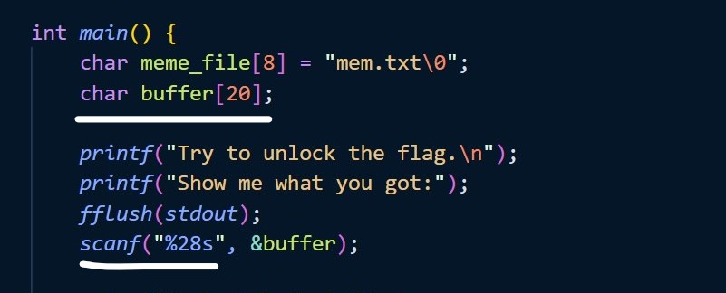
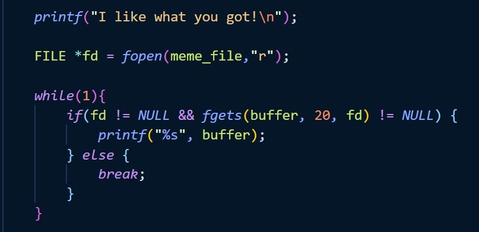
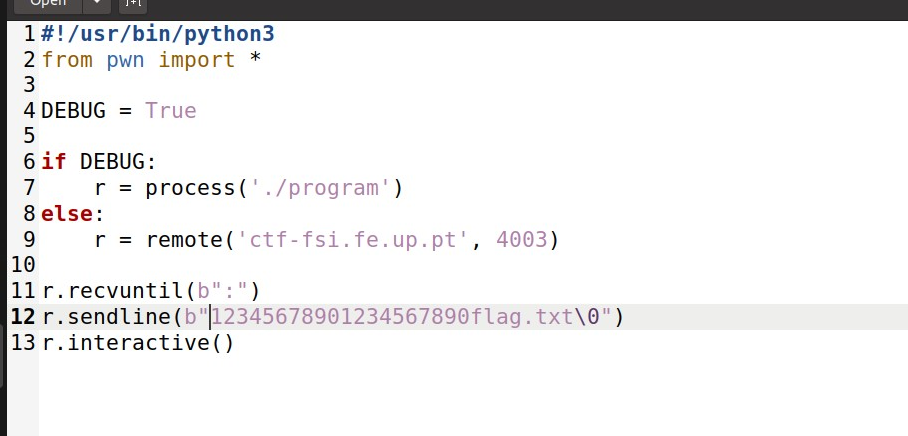
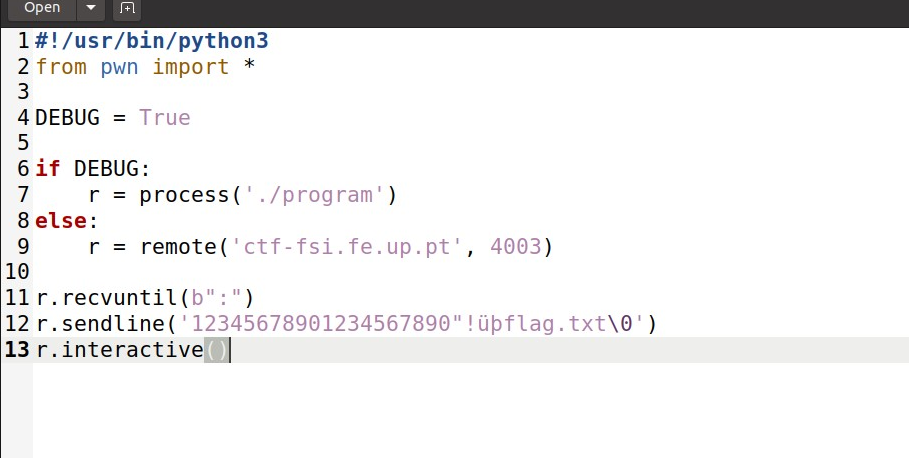

# Buffer Overflow Attack Lab (Set-UID Version) Lab

## Logbook 5

This document describes the conclusions made after completing the Seed Labs tutorial on Buffer Overflow Attack targeting a Set-UID process. 

The following is an academic analysis made by students of master in Computing Engineering at the University of Porto.

The document follows the suggested division of the Seed Lab tutorial.

### Environment Setup

The first step suggested in the tutorial handles the necessity to stop a certain level of countermeasures that moderns O.S. like Ubuntu implements to avoid this kind of stack smash attack. The countermeasures disabled were:
 * Disable Address Space Randomization: With this option, OS would manage processes memory in a non-sequential format. The random segmentation of the memory makes the life of a stack smasher harder since it is introduce a randomness level in the process.
 * Configuring /bin/sh: This lab exploits one vulnerable Set-UID to acquire a privileged shell. By default bash, in modern O.S., prevents this kind of attack by lowering automatically the privileges of Set UI when it is executed using an execve()

### Task 1: Getting Familiar with Shellcode

In the first task, it is explained a topic that was already introduced in the theoretical classes of the course. Stack smashing attacks occur with the injection of low-level code, called "Shellcode".

### Task 2: Understanding the Vulnerable Program

Seed lab handout presents us with the vulnerable code. 

The code reads from a file (that will be the entry point of the attack) 517 bytes of data. Then invokes a strcpy() instruction to assign those 517 bytes of data to an array of only 100 bytes. 

This 417 bytes excess introduce the **buffer overflow** that will introduce harm in the code.

Finally, the handout requires us to change permissions of the object file resultant of the compilation of the vulnerable code to gain Set-UID privileges.

# Explain the program

### Task 3: Launching Attack on 32-bit Program

The purpose of task 3 of this Seed Lab handout is to craft the stack smashing whose previous tasks were introduced.

As mentioned above the exploit of this attack will be a file named "badfile". We are going to inject a specific payload to achieve the attack purpose, acquire access to a privileged shell.

To this, many countermeasures were, for educational purposes, turned off on the operating system, otherwise the attack wouldn't work. (Read Task 1 and Task 2).

Another point that is relevant before describing how we made it, is to understand the concept of a [NOP](https://en.wikipedia.org/wiki/NOP_(code)):

According to wiki: "In computer science, a NOP, no-op, or NOOP (pronounced "no op"; short for no operation) is a machine language instruction and its assembly language mnemonic, programming language statement, or computer protocol command that does nothing."

NOPs are null bytes, they are useful in this type of stack attack because of the behaviour CPU has when it processes this Bytecode, **it skips to the next byte memory.**

Finally, Seed Lab provide us with a python script whose intent is to help students craft the badfile, mention above. 

Our unique task is to fill the python script with the correct parameters. However, this simple task is not straightforward, random values would result in segmentation faults crashes, not the intended goal. There is a rationale behind that determines the success of the attack.

A situation of crashing is avoided by real hackers because it is usually associated with intrusion detection techniques. Criminals don't want their identity revealed. Striking at the first attempt is critical.

### Understanding the attack:

#### Memory layout

A typical memory representation is shown below.

Stack smashing attacks take advantage of this architecture, and exploit the fact return address is the last information of each frame, to modify it to point to intended places that compress the malicious shellcode.

Operating systems deny direct access to memory frames of other functions' frames, for that reason is critical to obtain the address of the nearest element of the return address that is associated with the current frame, the frame pointer. Knowing the frame pointer is fundamental to performing inline exploitation of buffer overflow vulnerabilities. In x86 architectures, the frame pointer is stored in a specific register the %ebp.

### The attack:

1. Fill the badfile with 517 bytes of NOPs.
2. Calculate the number of bytes occupied by the shellcode: (27 bytes).
3. Inject the shellcode at 27 bytes from the end of the file byte stream.
4. With the help of the debugger gdb, determine the memory address of the frame pointer of the bof() function, by asking for %ebp register content(0xffffcaec).
5. With the information gathered in point 4. We can calculate the address where the return address stays by subtracting 4 bytes.
6. Manipulate the value of that return address for a place in code that targets before the beginning of the shellcode injection.
7. Let the NOPs work on their one, CPU will skip them, until finding the malicious shellcode is executed.
8. Congratulations you have a privileged shellcode

#### The Badfile Crafter Script

The following print screen represents the content of the exploit.py script that the seed lab provide us to fill with the proper arguments that successfully exploit the process.

###### Understand the file content

1. We inject the 32 bits version of the shellcode
2. Then we initialize the entire file with NOPs
3. We place the malicious code at the end of the payload
4. With the information gather from %ebp and buffer we craft a sufficiently large address where we want to return to find NOPs that takes us to the shellcode, but it should not be larger than overtake the place where we settled the shellcode. oxffffcc28 was our bet.
5. The value betted in 4. should be inserted in the return address that relatively to beginning of the buffer address is 112 bytes higher in the stack, which means that "oxffffcc28" should be written in the badfile with an offset of precisely 112 bytes 
6. We open the file and write the content to it

**IMPORTANTE: Estamos a adicionar a informação sobre os CTF à posteriori tal como indicado pelo professor Manuel Barbosa, no email de dia 15/12/2021 trocado com o aluno up201704618**

## CTF Week 5

Week 5 CTF compresses two challenges. They both target the topic of Stack Smashing by exploiting a buffer overflow.

This CTF cannot be seen isolated from the conclusions we made in the document above while exploring the Seedlab task on the same topic. By completing with success Seedlab we were able to easily achieve the results expected in the CTF assignment.

As mentioned in Moodle, to simplify our task, running checksec software returns the assurance that there are none of the many countermeasures, developed over the years to avoid this kind of attack, active.

These two assignments aren't the same as the ones in Seedlabs, they are simpler. In Seedlabs and the generic approach presented in the theoretical classes, stack smashing attacks were presented as attacks that intend to modify the return address of a function to modify the flow to execute malicious shellcode controlled by the malicious attacker.

In this CTF there are no return address manipulation or shellcode injection, like in Seedlab, but there are local variables that need to be modified by exploiting a buffer overflow.

### Challenge 1

The source code for challenge 1 is shown below. The buffer overflow is underlined in white. It happens because there is a mismatch between the buffer of size 20 bytes and the read of 28 bytes in the scanf instruction.

    

Without any counter-measure and because of this specific variable declaration order, when the extra 8 bytes are overflowed variable *meme_file* is overwritten with content injected in the malicious payload.

The *meme_file* variable controls a file read from memory. Since we know that the content of the flag is stored in a file called flag.txt. Our task is to manipulate the mentioned variable to value "flag.txt" so that when the program runs, it will instead of "meme_file.txt" dump "flag.txt"

    

This manipulation needs to fit in the 8 extra bytes possible to write in memory. Since flag.txt contains exactly 8 bytes, no problems can arise from that. Then the final payload is PrintScreen bellow. We inject 20 bytes of thrash to fill "buffer" and inject "flag.txt" in the trailer of the payload to overwrite the meme_file variable.

    

### Challenge 2

Challenge 2 is similar to challenge 1, there is a buffer overflow vulnerability that can be exploited to overwrite the content of local variables.

Instead of a buffer overflow of 8 bytes, in challenge 2, the overflow is 12 bytes. This excess allows us to overwrite local variables *val* and *meme_file*

Like in challenge 1, there is a piece of code that dumps the content of a file based on the content of *meme_file*, we need to change its value to flag.txt to dump the content of the flag file.

There is extra protection in this second step, the introduction of a key variable that needs to be matched to access the functionality of file dumping. The key, hexadecimal 0xfefc2122 can be manipulated by changing the content of *val*.

Using an online hexadecimal converter to ASCII, we discover the ASCII representation for 0xfefc2122 is: *þü!"*

This is the string payload that we need to inject to crack the key countermeasure. **One subtle trick that took us some time to overcome was the need to convert 0xfefc2122 representation to little-endian. This way the string needs to be reverted "!üþ**

The final payload is the PrintScreen below.

    

