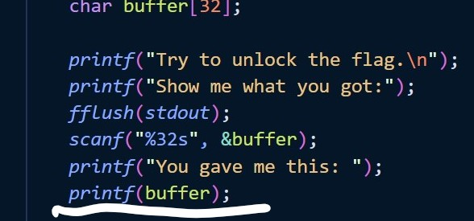
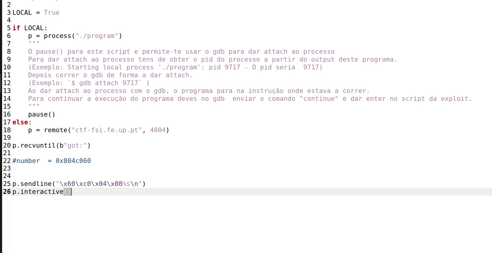
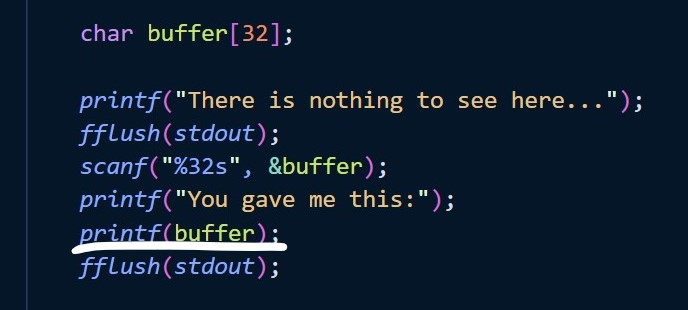
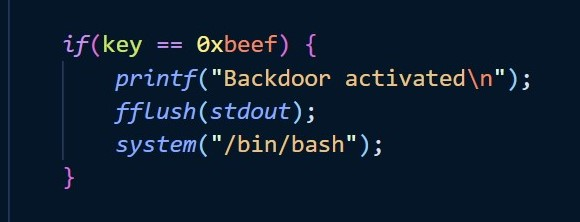
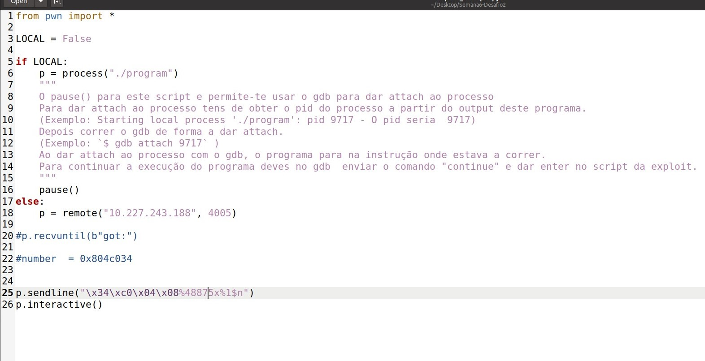

# Format String Attack Lab

## Logbook 6

This document describes the conclusions made after completing the Seed Labs tutorial on Format String exploitation.

The following is an academic analysis made by students of master in Computing Engineering at the University of Porto.

The document follows the suggested division of the Seed Lab tutorial.

### Format Strings and Memory Layout

Before describing the tasks completed, it is important to understand what is format string exploitation.

According to the Wiki, format exploitation is:

> Uncontrolled format string is a type of software vulnerability discovered around 1989 that can be used in security exploits. Originally thought harmless, format string exploits can be used to crash a program or to execute harmful code. The problem stems from the use of unchecked user input as the format string parameter in certain C functions that perform formatting, such as `printf()`.
> A malicious user may use the `%s` and `%x` format tokens, among others, to print data from the call stack or possibly other locations in memory.
> One may also write arbitrary data to arbitrary locations using the `%n` format token, which commands `printf()` and similar functions to write the number of bytes formatted to an address stored on the stack.

#### Preconditions

The widely famous `printf()` function inserts itself into a family of functions with a variable number of parameters.
This function is composed of two parts:

- A format string that specifies the type and number of variables to be printed out
- The variables to print.

If there is a mismatch between these two elements, we face a format string vulnerability.

There is an internal special pointer that links the two topics above, a disconnection between them and the pointer can be manipulated to print/write to the wrong place.

#### Exploit

After that, there are two possible exploits this vulnerability opens the door to:

- Memory Dump - By injecting %... as input to the `printf()` this function will read the memory. Allowing unlimited dumping of the memory segment values.

- Memory Rewriting - `printf()` includes a special formatter, %n, that allows writing the number of characters printed so far to the referenced variable.

<div style="text-align:center">
    


###### Fig.1 - Explanation of printf() function with %n

</div>

#### Memory organization

`printf()` is placed in memory in the code segment. Which is situated in the lowest values of the stack. This turns this type of attack truly powerful because the range of memory possible to dump is incredible large

<div style="text-align:center">


###### Fig.2 - Explanation of the way that the stack saves addresses

</div>

### Environment Setup

#### Disable Counter Measures

Modern OSs like Ubuntu 20.04 implement countermeasures to mitigate this kind of attack. The state of the art technique is called memory address randomization.

This type of attack is only efficient if the memory follows a straight linear sequence. To avoid this linear representation of the memory, OSs shuffle the segment of memory they allocate to each process.

To disable memory randomization to complete this lab, you need to type the following command:

```shell
sudo sysctl -w kernel.randomize_va_space=0
```

#### The Vulnerable Program

The segment of code that contains the format-string vulnerability is specified below.

Since this `printf()` invocation doesn't specify a format string, it allows unlimited code injection.

The entry point for exploitation is a file where will be injected crafted payloads.

```c
void myprintf(char *msg)
{
    printf(msg); // This line has a format-string vulnerability
}
```

### Task 1: Crashing the Program

To crash a program using a format-string vulnerability we can simply invoke the following command:

```c
%s%s%s%s%s%s%s%s%s
```

This command will make the execution interpret the first addresses it finds after the segment where the string format is stored as pointers to strings with a '0' terminator.

The crash happens because these values are not valid memory addresses which will cause a segmentation fault.

> The rule above is empirically determined. It could generate valid output if there are sequently 10 valid pointers to string address in that place of the stack, but we guess this could happen with a probability lower than the destruction of the universe :)

### Task 2: Printing Out the Server Program’s Memory

As mentioned above, printing memory, is one of the two main possibilities this kind of vulnerability allow the attacker to exploit.

The mean of attack always includes the injection of format specifiers, usually `%x`, the specifier for dumping the memory content in hexadecimal format.

#### Task 2.A: Stack Data

As mentioned above, in the preconditions topic of this document, these types of attacks occur when is possible to manipulate the internal pointer that `printf()` controls in its low-level code.

Reminding the vulnerable code:

```c
void myprintf(char *msg)
{
    printf(msg); // This line has a format-string vulnerability
}
```

There is a gap between the low address in memory where the `printf()` code is stored and the place where the char\* "msg" (see code above) is mapped in the stack. This gap is essential to be determined to reproduce this attack.

This task solves that need, we must find the number of hops, N, in the memory we need to make to align the printf() internal pointer to the char\* "msg" location in memory.

This will allow us to execute operations by introducing a format specifier at the position N+1 of the injection buffer.

The simplest way to obtain this information is by trial and error. We start the malicious payload with a unique C string to serve as a flag in the code.

Then we inject an increasing amount of `%x` specifiers until we find in the memory dump the hexadecimal representation of that flag. When that happens this task is completed.

In our case, we determined that the distance between the format string address and the variable location were the injection of **64 "%x"**.

#### Task 2.B: Heap Data

There is a secret message string hidden in the address 0x080b4008. Our task is to print it.

This objective is the extension of task 2A. We need the calculation performed by trial and error made before to point the `printf()` pointer to the correct place in memory using `%x` to jump through memory, then execute a final `%s`, in this case, to print the string.

We need to write this address in the little-endian format to the beginning of the payload, this value will be interpreted in the same way the flag string was interpreted in task 2A.

**Then, there is an additional small trick:** Since we need to introduce an extra %s format specifier this means that the code will perform an extra hop, so to do it properly, we need to remove one of the %x specifiers.

We come out with the following configuration in the build_string script, an auxiliary python program provided to craft the custom payload:

<div style="text-align:center">


###### Fig.3 - Code and output after the attack.

</div>

##### The secret message is: "A secret message".

### Task 3: Modifying the Server Program’s Memory

As mentioned above the exploitation of a string vulnerability can target mainly two topics:

1. Read the Memory - The previous focus on that.
2. Write to Memory - Using the `%n` format specifier it is possible to exploit over a deprecated form that allows a printf() invocation to overwrite values in memory.

Task 3 targets option 2. We will use the capabilities of `%n` to write specific values to a specific memory address.

#### Task 3.A - Change the value to a different value

To alter the value of the `target` variable to any other values we need to skip over the 63 addresses, using `63 * ".8%x"` on the built string, so we reach the memory address of the buffer, and then append `%n` to the end of the built string, meaning that we will overwrite the value of `target`.

```python
63 * "%.8x" + "%n"
```

As mentioned in a previous section of this document, every time the exploited server receives a request, it dumps some information to help students to understand if their attacks are taking place or not. One of this information is the current value of the variable value.

After injecting the simplest valid %n payload the output of the value variable was hexadecimal 0x1FC that is equal to 508 in decimal base, which represents 63 addresses of 4 bytes(represented in hexadecimal by 8 letters/numbers) plus 4 more bytes representing (size of the memory address of &value = 0x080e5068) we injected at the beginning of the payload.

#### Task 3.B - Change the value to 0x5000

The starting point to complete this subtask successfully is task 3.A. Injecting the payload above returned as expected and explained 508 bytes being written to the memory address 0x080e5068.

To alter the value of the `target` variable to `0x5000` we need to skip over the 63 addresses as we did before, but in this case, we have to inject 19972 extra characters to then append `%n` to the end so that we write 0x5000 as an integer to the memory.

Why 19972 characters? Keep in mind that 0x5000 represents 20480 in decimal base. The value 19972 emerged from the subtraction to that value of the 508 bytes that are required to inject to point the printf() to the correct buffer address.

##### How to print 19972 characters using printf()?

C ships with a special kind of string formatters that allow printing numbers with extra padding. These kinds of features are useless in the daily use of this language, however are a powerful friend for format string attackers.

This family of format strings are the following:

```c
"%.19972d"//Prints an integer 0 with 19972 padding zeros.
```

The alternative would require us to write 19972 characters manually in the badfile. This option is more practical.

##### A Last Trick

In this last section there was an extra obstacle that required us extra attention and analysis:

1. Every time we inject a %x/%d (all % formatters except %n) the memory hops one address.
2. We added this extra %d to inject the 19972 characters

We didn't notice at the first touch the effect this %d would introduce. So we keep trying to inject 63 %x elements before. This result in a segmentation fault every time we tried to run the code.

That extra hop made the printf() pointer point to the wrong address. That means we were trying to inject a value in the incorrect address.

To overcome this trick. We were forced to:

1. Remove one %x in the payload (to 62).
2. This made the injection of the characters increase by 8. To balance the reduction of one %x that produces 8 extra hexadecimal characters.

The final payload is specified in the printscreen of the build_string.py utility:

<div style="text-align:center">
    


</div>

###### Fig.4 - Attack code for task 3.B

**IMPORTANTE: Estamos a adicionar a informação sobre os CTF à posteriori tal como indicado pelo professor Manuel Barbosa, no email de dia 15/12/2021 trocado com o aluno up201704618**

## CTF Week 6

CTF week 6 targets format string exploits. We were able to solve this task after completing the SEED LAB described above.

The CTF task for week 6 compresses two challenges, both on format strings. The second is unlocked after solving the first one:

1. Dump the Content of a flag stored in a global variable flag.
2. Flag is stored in a file that is not loaded into memory. But there is the possibility to gain access to a system shell.

### Format String Attacks

Remembring the content we detail above in the Seed lab description of this document, there are two major types of attacks a format string vulnerability allows a malicious agent to exploit a system for:

- **Memory Information dumping**- By injecting %x in a vulnerable printf buffer we are, in theory, capable to dump the entire memory segment of the program.
- **Memory Content Modification**- Using the special format string specifier, %n, we can change the value stored in a given address.

Moreover, we remember that this kind of attack requires us to disable some operating system countermeasures to this kind of attack, the most common one is disabled randomization of the virtual memory segment. This countermeasure is explained at the [beggining of this document](#disable-counter-measures).

Finally, mention that this kind of attack typically follow 4 steps and are done in 2 turns:

1. Discovery the address we want to exploit from a third-party tool, for example, GDB debugger.[Turn 1]

2. Place a flag in the head of the malicious payload together with format specifiers, typically %x, to determine the byte offset from the address where the format string pointer is stored to the content of that format string. [Turn 1]

3. After determining the offset we typically inject the address we want to manipulate in little-endian format at the head of the malicious payload with the correct amount of %x determined in step 1 to allow the internal printf pointer to "climb" in the stack and target the address where the address inject is stored.[Turn 2]

4. Then we typically inject a %s to read the content of that address or use %n to modify its content. [Turn 2]

### Challenge 1

Challenge is easier to achieve than challenge 2 since the flag is loaded in memory. As mentioned above we engine the typical 3 steps attack. But before we used checks as mentioned in moodle to ensure that memory addresses are static. They are.

CTF server runs a clone of the local execution, which means that if we are successfully locally, we will be able to reproduce it remotely. This also includes the address in memory.

The printf that contains the vulnerability is underlined in the picture below:

<div style="text-align:center">
    


</div>

- Because the format string is not specified in this printf, it accepts all types of content and every type.

- Since the argument of printf, the "buffer" variable, depends on an external input, there are no limitations that deviates this attack from the general template of format string attacks.

#### [Step 1] Extract flag variable Address

To determine the address flag global variable is stored we used GDB, similar to what we did in the previous CTF, place a broken line in an arbitrary line of the main function and then, ask the debugger to print the address of &flag with the following command:

    p &flag

The result was: 0x804c060

Though, there was a subtle trick regarding the use of GDB in this CTF. When the program starts locally it publishes its PID, we then use gdb attach _pid_ to attach a gdb CLI to the process, then we simply execute the GDB instruction above.

This means that flag content is stored in 0x804c060. That is the address we want to exploit

#### [Step 2] Determine the Offset between the format string pointer and the buffer location in memory

To determine the offset between these two locations, we crafted a trial and error methodology, where we inject at the beginning of the payload the string "aaaa" followed by multiple %x.

Then we expect to find 0x40 appearing four times together in the payload, this would represent that we have enough %x to reach the buffer location. Then we just need to count the number of bytes printed by %x until "aaaa" and we extract the value of the offset.

In task 1 it wasn't necessary, contrarily to the Seed Lab many explorations, since it prints that content immediately, which mean that the buffer is stored immediately after the pointer to the format string.

#### [Step 3] Inject the Payload

This problem is a simple read problem, there is no need to add complexity rather than the introduction of a %s format specifier at the correct place to dump the content of the flag. Since the offset is 0, the content of the payload was a simple **%s**. A print screen of the content of the python script for payload crafting is presented below:

<div style="text-align:center">
    


</div>

### Challenge 2

Challenge 2 includes itself in the other type of attacks format strings opens the door to, the use of %n, to manipulate values stored in memory.

In Challenge 2 the tasks get sharper than task 1 because the flag is not loaded into memory. It is rather possible to obtain it indirectly by assuming control of a bash shell.

The vulnerability is the same as challenge 1, a printf without a format string specified whose arguments depends directly from an external input possible to be controlled by a malicious agent.

<div style="text-align:center">
    


</div>

The seizing of control of the shell will happen if we manipulate the value of the local variable key and manipulate its value to contain the value Hexadecimal 0xbeef (48879 in decimal base). In other words, we would be successful in our attack if we were able to pass the true condition of the code segment present below:

<div style="text-align:center">
    


</div>

#### [Step 1] Extract variable Address

The methodology to extract this information was the same that in challenge 1 but targeting the variable key rather than a flag. Using the pid that is printed by the vulnerable program, we attached a GDB CLI to this process and were able to get the address of the key by executing the following GDB command:

    p &key

The value returned was: 0x804c034

This means the key variable lives in memory in address 0x804c034. And if they want to manipulate its value, we need to execute a %n format string attack over targetting this address.

#### [Step 2] Determine the Offset between the format string pointer and the buffer location in memory

We perform the same type of operation using a flag to determine the offset. We determined that like in Challenge 1, the flag doesn't require extra offset, it is next to the format string pointer.

#### [Step 3] Inject the Payload

**Step 3 composes the biggest challenge we face in the entire CTF. It requires us to browse the web to successfully perform this attack. The problem is associated with the size of the buffer being restricted to 32 characters.**

Since 0xbeef correspond to 48879 in decimal base, to modify the value of the key to this value we need to use %n specifier and inject previously 48879 chars in the payload.

**But how can we inject 48879 characters in a buffer of just 32 bytes?**

The question above retains our attention. We found the solution on the web, by discovering a more professional way to inject payloads for exploits using %n. If we specify %n using the following syntax: _amount of chars_%1$n. It is introduced in the printf buffer padding that isn't taken into account for the 32 bytes.

The malicious string that allows us to seize control of the shell was the following:

<div style="text-align:center">
    


</div>

#### [Step 4] Exploit the Shell

After obtaining the control of the shell, we simply perform a cat command to read the content of the flag.txt file by performing:

    cat flag.txt
